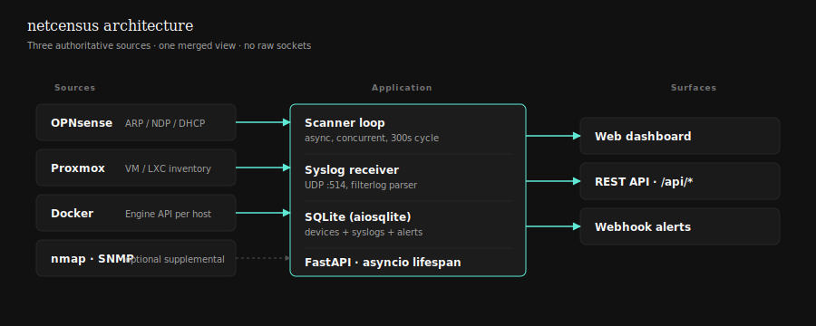

# netcensus — architecture

*A unified view of every device on a segmented homelab network — bare metal, VMs, LXCs, and containers — discovered without raw sockets, without layer-2 probes on every VLAN, and without root on the core discovery path.*

---

## 1. The problem

Standard network scanners rely on layer-2 ARP broadcasts. A process sends ARP requests and maps replies to IP/MAC pairs. This works fine on a flat network. In a segmented one, it has a structural flaw: **ARP does not cross VLAN boundaries**. A scanner running on VLAN 30 is completely blind to devices on VLANs 10, 20, or 99. Every VLAN boundary is a hard visibility wall.

The usual workarounds are all painful at scale. Running a scanner per VLAN multiplies operational burden and requires a reachable host on every segment. Promiscuous-mode capture at the router level requires raw sockets and root privileges — and still only answers "who is on the wire," not "is this a VM or a container." Flooding every segment with ARP probes is noisy, requires root, and doesn't tell you anything about the guest stack sitting above the MAC.

The deeper problem is that layer-2 scanning answers the wrong question. Knowing that `10.30.40.5` responded to ARP on `aa:bb:cc:dd:ee:ff` tells you very little about what that device actually is. It can't tell you which Proxmox node owns that VM, what containers are sharing that host's network stack, or whether the device is stopped and the IP has been reallocated. Answering those questions requires asking the systems that already have that information — not inferring it from traffic.

## 2. Solution

The application bypasses layer-2 entirely by querying the three authoritative sources that already have complete network visibility. **OPNsense**, as the edge router, maintains the global ARP table (IPv4) and NDP neighbour table (IPv6) for every VLAN it routes. One authenticated HTTPS call to its REST API returns every network-present device across all segments — something no single-segment scanner can match. **Proxmox** knows the MAC address, VMID, node assignment, and power state of every guest before a single packet hits the wire. It's the ground truth for what's a VM versus bare metal. **Docker Engine API** reports running containers with their virtual MACs and bridge IPs — and crucially, it knows which containers are running in host-network mode and therefore share the daemon host's identity.

These three sources are queried concurrently every scan cycle and merged into a single SQLite-backed device registry. The result is a real-time inventory with full-stack context for every endpoint on the network. Optional nmap ping sweeps and SNMP ARP-cache walks cover edge cases — subnets not routed through OPNsense, or managed switches that maintain their own ARP tables.



## 3. Architecture walk-through

### 3.1 Discovery loop

The core of the application is a background task that runs on a configurable interval (`SCAN_INTERVAL_SECONDS`, default 300). Each cycle calls `_run_scan_once()`, which fires all seven sources concurrently via `asyncio.gather`:

1. `query_opnsense()` — OPNsense global ARP table (IPv4)
2. `query_opnsense_ndp()` — OPNsense NDP neighbour table (IPv6)
3. `query_opnsense_dhcp()` — active DHCP leases (hostname population)
4. `query_proxmox(PROXMOX_NODES)` — Proxmox VM/LXC inventory, all nodes
5. `query_docker(DOCKER_HOSTS)` — Docker container inventory, all daemons
6. `query_nmap(NMAP_SUBNETS)` — optional nmap ping sweep
7. `query_snmp(SNMP_HOSTS)` — optional SNMP ARP-cache walk

Each source is independently fenced: if OPNsense is unreachable, the scan continues with Proxmox and Docker results. Failures are logged and reflected in the per-source health flags exposed by `/api/health`. The UI renders each source as a coloured dot — green (fresh), amber (stale), red (unknown) — based on whether the last-ok timestamp is within `SCAN_INTERVAL * 2`. This makes source failures immediately visible without the operator having to check logs.

### 3.2 Merge strategy

After all sources return, results are merged into the `devices` table with a defined priority order. **OPNsense ARP is the ground truth for network presence**: a device exists in the registry if and only if it has been seen by OPNsense ARP, Proxmox, or Docker — not by inference. When OPNsense ARP and nmap or SNMP report the same MAC with conflicting IPs, OPNsense wins. nmap and SNMP results are folded in only for MACs not already present in the ARP table.

**Proxmox entries enrich existing ARP rows** rather than creating new ones. When a VM's MAC appears in both the OPNsense ARP map and the Proxmox inventory, the device row is enriched with node name, VMID, and power state. When a Proxmox guest is offline and therefore absent from ARP, it is upserted with the IP last reported by the QEMU Guest Agent or LXC interfaces endpoint — so stopped guests remain visible.

**Docker entries are handled independently**. Bridge-networked containers get their own rows, keyed by virtual MAC. Host-network containers — which share the daemon host's MAC and IP — are not upserted as separate rows. Instead, they are collected during the merge loop and written into the host device's `metadata` JSON blob via `merge_host_containers()`, leaving the host's `device_type`, `vendor`, and identity columns untouched.

**The MAC address is the canonical device identity** throughout. All upserts are `INSERT … ON CONFLICT(mac) DO UPDATE`. IPs are treated as derived and mutable; MACs are durable. This means device history, manual aliases, disappearance counts, and notes survive DHCP churn, VM migration, and container restarts.

### 3.3 Syslog pipeline

An async UDP server runs concurrently with the FastAPI app, implemented as `asyncio.DatagramProtocol`. It binds on `SYSLOG_PORT` (default 514) and is started inside the FastAPI lifespan, sharing the event loop with the scan task and the HTTP server.

The parser handles two wire formats: **RFC 3164** (`<PRI>Mmm DD HH:MM:SS HOSTNAME TAG: MSG`) and the OPNsense `filterlog` CSV format. The filterlog parser is the most OPNsense-specific piece: firewall rule log lines are comma-separated with a variable number of fields. Position 26 (the destination port) can be absent on older OPNsense builds when the logged packet is ICMP — the parser treats all positions beyond the mandatory prefix as optional and gracefully handles short records. The output is a human-readable summary: `[BLOCK] IN on igb0 | tcp 1.2.3.4:443 → 10.30.0.5:8080`.

When a log arrives from `127.0.0.1` (i.e., via an rsyslog relay running on the same host), the parser uses the HOSTNAME field from the message body as the real source IP rather than the UDP source address. This allows centralised syslog forwarding without losing per-device attribution.

All DB writes from the syslog path are scheduled as `asyncio.create_task` so they never block the receive loop. A 30-day rolling purge runs once per scan cycle to bound database size.

### 3.4 Disappearance and alerting

Every scan cycle, `update_disappearance_counts(seen_macs)` increments the `disappearance_count` column for every device whose MAC was not present in the current scan. When a device is seen again, its `disappearance_count` resets to zero via the upsert's `ON CONFLICT DO UPDATE` clause.

When `disappearance_count` reaches `ALERT_DISAPPEARANCE_THRESHOLD` (default: 3 consecutive missed scans), the scanner fires a `device_gone` webhook. When a device is seen for the first time, it fires `device_discovered`. Both events POST a structured JSON payload to `ALERT_WEBHOOK_URL`:

```json
{
  "event": "device_gone",
  "timestamp": "2026-04-23T14:22:00Z",
  "device": {
    "mac": "aa:bb:cc:dd:ee:ff",
    "ip": "10.30.40.5",
    "alias": "proxmox-node-2",
    "vendor": "Super Micro Computer",
    "device_type": "bare-metal",
    "last_seen": "2026-04-23T13:52:00Z"
  }
}
```

Webhook delivery is fire-and-forget with a 5-second timeout. Failures are logged as warnings — the monitoring app does not retry, because transient webhook failures should not affect the scan cycle.

## 4. Design decisions and tradeoffs

### Why SQLite, not Postgres

netcensus is a single-process application with a straightforward write pattern: one scanner writes once per 300-second cycle, and the syslog server appends entries as UDP datagrams arrive. There is no concurrent-write pressure that SQLite's single-writer model can't handle — `aiosqlite` serialises all writes through a single async connection, which maps cleanly onto asyncio's own single-threaded event loop. Adding Postgres would mean adding a separate container, a connection pool, and a persistence volume to manage, with no benefit for this workload. SQLite's file-based storage also makes backup trivial: `cp network_monitor.db backup.db` is a complete backup. For a homelab tool that runs on one host and serves one operator, zero ops burden is itself a feature.

### Why async-first, not threaded

The syslog server and the scan loop must run concurrently without blocking each other — and both need to write to the database. The canonical threaded approach would be two threads sharing a queue, with a third thread draining writes. That works, but it introduces lock management, thread-safety concerns on the shared state (`_source_health`, `_host_net_containers`), and more moving parts to debug when something goes wrong. `asyncio` handles all of this without explicit locking: the event loop is single-threaded, so shared state is safe to read and write without mutexes. `asyncio.gather` runs all seven source queries concurrently within the same loop, and `aiosqlite` provides a non-blocking DB interface that fits naturally into it. The one exception is SDK calls (Docker, Proxmox) that use blocking I/O internally — those are offloaded via `run_in_executor` to avoid stalling the loop, while still integrating cleanly with `asyncio.gather`.

### Why the OPNsense API replaced scapy as the primary discovery path

The original prototype used `scapy.srp()` to send raw ARP broadcasts. That approach has two hard constraints: it requires `CAP_NET_RAW` or root, and it only sees one layer-2 segment — whichever interface the process is bound to. Both constraints get worse as the homelab grows. Adding a VLAN means adding another scanner instance and another privileged process. OPNsense is already the authoritative router; its ARP and NDP tables are the definitive view of every IP-to-MAC mapping on every VLAN it routes. One authenticated HTTPS call over the management API replaces one raw-socket scan per VLAN, removes the root requirement from the core discovery path, and returns richer data (interface name, expiry status, IPv6 neighbours) than ARP replies alone. `scapy` is still present in `src/scanner.py` as an optional fallback for environments with no OPNsense API — air-gapped homelabs or setups where the router doesn't expose a management interface. It is no longer part of the main discovery loop.

### Why webhooks, not push notifications

Webhooks integrate with anything without requiring netcensus to own the notification stack. A `device_gone` event POSTed to an HTTP endpoint can be handled by Home Assistant, n8n, ntfy, a Slack incoming webhook, or a five-line shell script — whatever the operator already has. Push notification services require maintaining a registered application, a notification server, and credentials. That's appropriate for consumer apps with thousands of users; it's unnecessary complexity for a homelab tool where the operator already has an alert routing pipeline. The job here is to emit a clean, structured event at the right moment — not to own the last mile of delivery.

### Why vanilla HTML + Tailwind CDN, not a framework

No build step means no Node.js, no npm, no bundler, and no `node_modules` directory in the Docker image. The entire frontend is `frontend/index.html` — one file, fully auditable without tooling, deployable by copying a single file. Tailwind via CDN adds the CSS utility layer without the PostCSS pipeline that would otherwise be mandatory for tree-shaking. The bundle-size tradeoffs that matter at scale — CDN latency, full Tailwind weight — don't apply for a tool that serves one dashboard to one person on a LAN. A React or Vue build would also add an ongoing maintenance surface: keeping bundlers, loaders, and framework versions in sync is real work. Vanilla JS has no upgrade path to maintain.

### Why MAC as the device identity, not IP

IP addresses are ephemeral. DHCP leases expire and get reassigned. VMs migrate between Proxmox nodes and pick up new IPs. Docker containers restart with new bridge IPs. If the device table were keyed by IP, a VM migration would look like two separate devices — the old IP disappearing and a new one appearing — losing all history, aliases, and disappearance counts accumulated under the old IP. MAC addresses are durable: a VM retains its virtual MAC across reboots and migrations, a container retains its virtual MAC across restarts, a physical host's MAC never changes. Keying the `devices` table on MAC means that device history, operator aliases, custom type overrides, notes, and disappearance counts survive any IP change. The IP column is just metadata that gets updated in place on each upsert — not the identity.

## 5. Implementation notes (per module)

- **`src/main.py`** — FastAPI app, lifespan, endpoint definitions. The lifespan branches on `DEMO_MODE` so the demo path seeds the DB from `demo_seed.py` and never touches production integrations. All background tasks (scan loop, syslog server) are started inside the lifespan and cancelled cleanly on shutdown.

- **`src/scanner.py`** — scapy ARP fallback. Legacy; the OPNsense path is the primary discovery route. Still present for air-gapped homelabs with no OPNsense API. Binds to a configurable interface (`SCAN_IFACE`) and is only invoked if explicitly configured.

- **`src/opnsense.py`** — REST client for OPNsense ARP, NDP, and DHCP tables. Notable implementation detail: the DHCP endpoint (`/api/dnsmasq/leases/search`) accepts both `hwaddr` and `mac` as the MAC field name depending on OPNsense version and DHCP backend (dnsmasq vs. Kea) — the parser handles both. All three functions use `httpx.AsyncClient(verify=False)` with InsecureRequestWarning suppressed, which is correct for OPNsense's self-signed certificate on a LAN-internal management interface.

- **`src/identifiers.py`** — MAC OUI lookup, Docker TCP socket client, Proxmox API client. The interesting merge case is host-network Docker containers: they share the daemon host's MAC, so the merge logic collects them into `_host_net_containers` keyed by host MAC and writes them into the host's metadata blob via `merge_host_containers()` — never emitting a phantom IP row. Proxmox MAC extraction uses regex patterns covering all common virtio and emulated NIC types (`virtio`, `e1000`, `e1000e`, `vmxnet3`, `rtl8139`, `ne2k_pci`) plus LXC `hwaddr=` format.

- **`src/syslog_server.py`** — async UDP DatagramProtocol. Notable constraint: OPNsense filterlog CSV position 26 (destination port) can be absent on older builds for ICMP packets. The parser treats all fields beyond the mandatory header as optional and handles short records without raising. RFC 3164 timestamp parsing handles the year-rollover boundary (December → January) correctly.

- **`src/database.py`** — aiosqlite schema, migrations, upserts by MAC. The `_migrate_add_columns()` function idempotently adds new columns to existing databases (first_seen, metadata, ipv6, custom_type, disappearance_count, notes, scan_count, syslog_ip) — safe to run on every startup. `upsert_device()` intentionally excludes the `alias` column from the `ON CONFLICT DO UPDATE` clause so manual labels are never overwritten by a re-scan. NULL ip/ipv6 values never overwrite a real stored address. All writes go through one async connection to keep aiosqlite's single-writer model consistent across the scan loop and syslog server.

- **`src/demo_seed.py`** — deterministic seed for `DEMO_MODE`. Populates a fresh SQLite DB with a fixed homelab: 6 VLANs, 47 devices, a mix of bare-metal hosts, VMs, LXCs, and Docker containers, one intentional `device_gone` alert on VLAN 99. Deterministic output means a UI change and its dashboard screenshot can land in the same PR with a predictable before/after.

## 6. What's next

- Optional Prometheus metrics exporter (not yet — unclear if anyone but me wants it).
- Per-device timeline graph (scan-miss history over time — useful, needs a thoughtful schema change to avoid unbounded growth).
- UI tests via Playwright, scoped to the critical flows only (deferred; not worth the maintenance tax until the UI churns less).

---

*Back to [README](./README.md). Maintainer: Skyler King · [moshthesubnet.com](https://moshthesubnet.com).*
