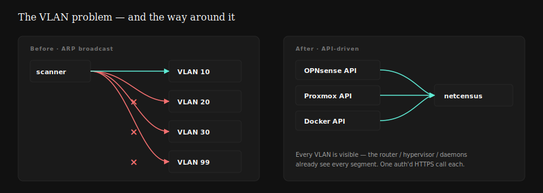
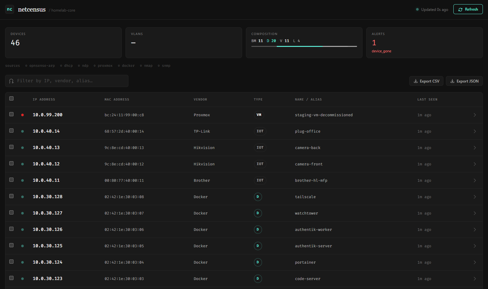
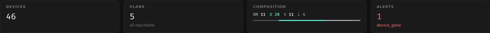
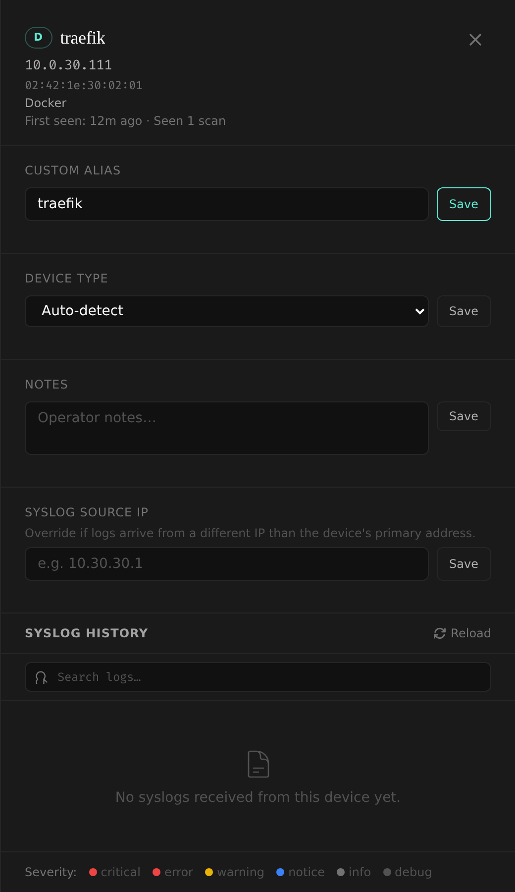
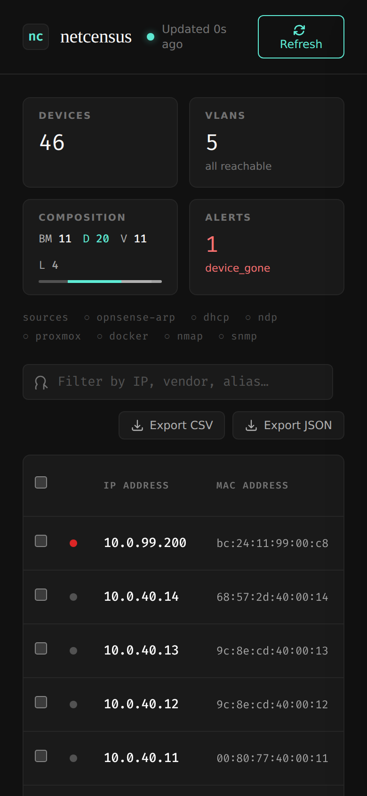

<h1>netcensus</h1>

Cross-VLAN homelab device inventory — every bare-metal host, VM, LXC, and container in one view. Queries OPNsense, Proxmox, and Docker instead of broadcasting, so no raw sockets and no per-segment scanners.

**Try it in one command** (no config, no credentials):

```bash
docker compose -f docker-compose.demo.yml up
```

Then open <http://localhost:8080>.

---

## The problem

Standard network scanners rely on layer-2 ARP broadcasts. A process runs on a host, sends ARP requests, and maps replies to IP / MAC pairs. In a segmented network, this has a fundamental flaw: **ARP does not cross VLAN boundaries**. A scanner running on VLAN 30 is blind to VLANs 10, 20, 99. The usual workarounds — one scanner per VLAN, promiscuous-mode capture, flooding every segment — all need raw sockets, root, or brittle host-level configuration. None of them scale cleanly to a homelab with 5+ VLANs, dozens of VMs, and multiple Docker hosts.

Layer-2 also can't answer *is this IP a VM or a bare-metal host? Which Proxmox node owns it? What containers share a host's network stack?*



## The approach

- **OPNsense** as the edge router sees every VLAN it routes — its API returns the global ARP and NDP tables in one authenticated call.
- **Proxmox** knows every VM and LXC by MAC, node, and status before a packet hits the wire.
- **Docker Engine API** reports running containers with their virtual MACs and bridge IPs.

Query all three concurrently each cycle, merge into one SQLite-backed device registry, and you have every endpoint on the network — no raw sockets, no per-VLAN probes, no root required for the core discovery path.


## Dashboard



*Demo seed: 5 VLANs, 46 devices, one intentional `device_gone` alert on VLAN 99.*







## Feature highlights

- **Cross-VLAN discovery via OPNsense** — one authenticated call covers every VLAN the router is aware of.
- **Proxmox VM and LXC inventory** — per-node concurrent polling, QEMU Guest Agent IP fallback when ARP hasn't resolved yet, LXC `/interfaces` fallback, stopped guests tracked too.
- **Distributed Docker mapping** — multiple Docker Engine TCP sockets queried in parallel; host-network containers correctly attributed to the daemon host's ARP entry.
- **Automatic hostnames via OPNsense DHCP** — active leases populate names on discovery; manual aliases always win.
- **Integrated real-time syslog receiver** — async UDP on port 514, parses OPNsense `filterlog` CSV into human-readable rule summaries, links logs to their source device.
- **Optional supplemental scanning (nmap + SNMP)** — covers subnets not managed by OPNsense; SNMP walks managed-switch ARP caches.
- **Disappearance tracking and webhook alerts** — `device_gone` and `device_discovered` events POST to any HTTP endpoint.

Deeper technical detail in **[ARCHITECTURE.md](./ARCHITECTURE.md)**.

## Try it

**Demo (no infrastructure required):**

```bash
docker compose -f docker-compose.demo.yml up
# Dashboard: http://localhost:8080
```

The demo bypasses the scanner and syslog server and populates a fresh SQLite DB with a deterministic seeded homelab.

**Real usage:**

```bash
git clone https://github.com/moshthesubnet/netcensus.git
cd netcensus
cp .env.example .env
# Fill in OPNsense / Proxmox / Docker credentials
docker compose up -d
# Dashboard: http://<host-ip>:8000
# Syslog:    UDP <host-ip>:514
```

Bare-metal install (Python 3.12+): `python3 -m venv venv && source venv/bin/activate && pip install -r requirements.txt && sudo ./start.sh`. Root is required only to bind UDP 514.

## Stack

Python 3.12 · FastAPI · asyncio · aiosqlite · Tailwind (CDN). No build step.

---

Skyler King · [moshthesubnet.com](https://moshthesubnet.com) · MIT License · See [ARCHITECTURE.md](./ARCHITECTURE.md) for the deep dive.
